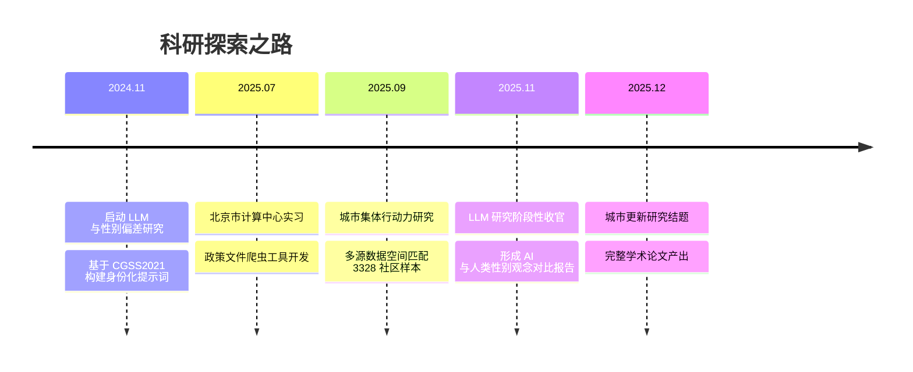

<div align="center">

<!-- 顶部装饰条 -->


<!-- 打字动画 -->
<p align="center">
  <a href="https://github.com/YureWright">
    
  </a>
</p>

<!-- 联系方式徽章 -->
<p align="center">
  <a href="mailto:2023200449@ruc.edu.cn"></a>
  <a href="https://github.com/YureWright"></a>
  
</p>

</div>

---

<!-- 关于我 -->
## 🌟 About Me

> **「以数据为笔，以代码为墨」**
> 在经济学与公共管理的交叉地带，我用 Python、爬虫与 AI 工具探索城市与社会议题。

- 🎓 人大在读 · 资源环境经济学 × 公共管理 **双主学位** · 高瓴人工智能学院荣誉辅修
- 📊 GPA **3.82/4.0** · 班级 **4/12** · 多项国家级/市级科研立项
- 🔬 关注 **城市更新、集体行动、LLM 社会偏见** 等议题
- 💻 熟练运用 AI 工具进行 **Vibe Coding**，让编程成为研究的"加速器"

---

<!-- 核心能力 -->
## 💎 Core Competencies

<table align="center">
<tr>
<td width="33%" align="center" bgcolor="#F0F8FF" style="border-radius:10px; padding:15px;">
<h3>🔬 交叉学科研究</h3>
<p align="left">✓ 城市经济与公共政策<br>✓ 计量模型与因果推断<br>✓ 大语言模型社会偏见</p>
</td>
<td width="33%" align="center" bgcolor="#FFFACD" style="border-radius:10px; padding:15px;">
<h3>💻 数据工程能力</h3>
<p align="left">✓ Python 全栈爬虫开发<br>✓ 多源大数据空间匹配<br>✓ 数据清洗与可视化</p>
</td>
<td width="33%" align="center" bgcolor="#F0F8FF" style="border-radius:10px; padding:15px;">
<h3>🤖 AI 应用探索</h3>
<p align="left">✓ LLM API 批量推理<br>✓ 提示词工程设计<br>✓ Vibe Coding 工作流</p>
</td>
</tr>
</table>

---

<!-- 数据看板 -->
## 📊 GitHub Stats

<div align="center">
  
  
</div>

<div align="center">
  
</div>

---

<!-- 精选项目 -->
## 🚀 Featured Projects

<div align="center">

<!-- 项目 1 -->
<table width="100%">
<tr>
<td width="60%" valign="top">

**🔍 [LLM_gender](https://github.com/YureWright/LLM_gender)** ⭐ 1  
大语言模型与性别偏差研究 · 2024.11-2025.11

- 基于 **CGSS2021** 全国 8000+ 样本数据
- 构建身份化提示词，调用大模型 API 完成批量推理
- 揭示 LLM 与人类在性别观念上的差异模式
- 项目负责人，独立完成全流程

</td>
<td width="40%" valign="top" align="center">


<br><br>

<br><br>


</td>
</tr>
</table>

---

<!-- 项目 2 -->
<table width="100%">
<tr>
<td width="40%" valign="top" align="center">


<br><br>

<br><br>


</td>
<td width="60%" valign="top">

**🏘️ [commu_power](https://github.com/YureWright/commu_power)** ⭐ 1  
城市更新中集体行动力影响机制研究 · 2025.09-2025.12

- 整合 **UTAUT 框架**与社会资本理论构建分析模型
- 融合百度 LBS、OSM 等多源数据，完成 **3328** 个社区样本空间匹配
- 采用两阶段零膨胀回归、**Tweedie 回归**处理高零值数据
- 形成完整学术论文，提供城市治理实证依据

</td>
</tr>
</table>

---

<!-- 项目 3 -->
<table width="100%">
<tr>
<td width="60%" valign="top">

**🛠️ [permission-engine](https://github.com/YureWright/permission-engine)**  
增强对 Coding AI 掌控力的 Skill / Harness

- 自研工具，让 AI 编程更可控、更可预期
- 探索 **Vibe Coding** 的工程化边界

</td>
<td width="40%" valign="top" align="center">


<br><br>


</td>
</tr>
</table>

</div>

---

<!-- 技能栈 -->
## 🛠️ Tech Stack

<div align="center">

| 类别 | 技能 |
|------|------|
| **编程语言** |    |
| **数据处理** |    |
| **数据采集** |    |
| **空间分析** |   |
| **AI 工具** |    |
| **可视化** |   |

</div>

---

<!-- 荣誉奖项 -->
## 🏆 Honors & Awards

<div align="center">

| 🏅 奖学金 | 🏅 竞赛获奖 | 🏅 科研立项 |
|:---:|:---:|:---:|
| 本科生学习优秀三等奖学金 | **全国大学生数学建模大赛** 北京市二等奖 | **"求是学术"品牌研究** 北京市级立项 |
| **国家励志奖学金** | 人大金融人工智能挑战赛 全校第 12 名 | 人大"创新杯"学生课外学术科技作品 **二等奖** |
| 中国人民大学优秀学生干部 | — | 人工智能赋能城市适老化更新项目 |
| 社会工作与志愿服务骨干奖学金 | — | 多智能体协作创新菜品生成系统 |

</div>

---

<!-- 实习经历 -->
## 💼 Internship Experience

<table>
<tr>
<td width="15%" align="center" bgcolor="#1E90FF" style="color:white; border-radius:5px;">
<b>2025.07<br>~ 2025.08</b>
</td>
<td width="85%" valign="top">

**🏛️ 北京市计算中心有限公司** · 爬虫工程师

> 负责北京政府网站、中国政府网政策文件爬虫工具的开发、测试与封装

- 设计**分级爬取逻辑**，适配多类政府网站结构特性
- 完善**异常处理与日志体系**，实现分批次保存、失败重试机制
- 封装**自动化执行脚本**，支持一键完成 URL 爬取、内容提取、附件下载分类
- 编写清晰的使用文档，提升工具易用性

</td>
</tr>
</table>

---

<!-- 科研时间线 -->
## 🔬 Research Timeline

<div align="center">



</div>

---

<!-- 当前关注 -->
## 🎯 Currently Exploring

```text
🔭 正在做    → LLM 社会偏见量化研究 / 城市更新集体行动机制
🌱 在学习    → 多智能体系统 / 高级计量方法 / Vibe Coding 最佳实践
💡 感兴趣    → AI for Social Good / 政策模拟 / 城市计算
🤝 寻找合作  → 城市治理 + AI 应用方向的科研项目 & 开源贡献
📫 联系我    → 2023200449@ruc.edu.cn
```

---

<!-- GitHub Activity -->
## 🐍 Contribution Graph

<div align="center">
  
</div>

---

<!-- Visitor Counter -->
<div align="center">


</div>

<!-- 底部装饰 -->


<div align="center">
  <sub>✨ Designed with 💙 & 💛 | Inspired by data, driven by curiosity ✨</sub>
</div>
